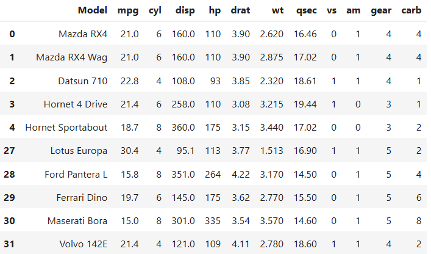
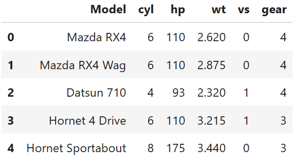
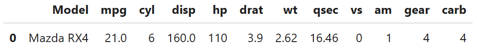
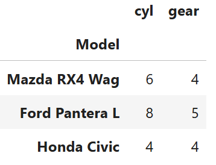

<h1 align="center"> ECE2112 Programming Assignment 3 (Pandas) </h1>

<a id="top"></a>

## Table of Contents
1. [About the Project](#about)
2. [Getting Started](#getting_started)
   - [Instructions](#instructions)
4. [Sample Problems](#problems)
   - [Problem 1](#P1)
   - [Problem 2](#P2)
5. [Author](#author)

<a name="about"></a>
## About the Project
- Programming Assignment 3 is about identifying the codes and functions in the Pandas library and applying them in creating a Python program.

<a name="getting_started"></a>
## Getting Started
- To run the given code, follow these instructions:
  
<a name="instructions"></a>
 ### Instructions
 1. Install **Anaconda Navigator** at https://www.anaconda.com/download
 2. Open **Jupyter notebook**
 3. Download and open _Ching_Pandas-P1.ipynb_ and _Ching_Pandas-P2.ipynb_
 4. Run the programs 

<a name="problems"></a>
## Sample Problems:
* For Problems 1 and 2, the following table shows the data set used:

| Model               | mpg  | cyl | disp  | hp  | drat | wt    | qsec  | vs | am | gear | carb |
|---------------------|------|-----|-------|-----|------|-------|-------|----|----|------|------|
| Mazda RX4           | 21.0 | 6   | 160.0 | 110 | 3.90 | 2.620 | 16.46 | 0  | 1  | 4    | 4    |
| Mazda RX4 Wag       | 21.0 | 6   | 160.0 | 110 | 3.90 | 2.875 | 17.02 | 0  | 1  | 4    | 4    |
| Datsun 710          | 22.8 | 4   | 108.0 | 93  | 3.85 | 2.320 | 18.61 | 1  | 1  | 4    | 1    |
| Hornet 4 Drive      | 21.4 | 6   | 258.0 | 110 | 3.08 | 3.215 | 19.44 | 1  | 0  | 3    | 1    |
| Hornet Sportabout   | 18.7 | 8   | 360.0 | 175 | 3.15 | 3.440 | 17.02 | 0  | 0  | 3    | 2    |
| Valiant             | 18.1 | 6   | 225.0 | 105 | 2.76 | 3.460 | 20.22 | 1  | 0  | 3    | 1    |
| Duster 360          | 14.3 | 8   | 360.0 | 245 | 3.21 | 3.570 | 15.84 | 0  | 0  | 3    | 4    |
| Merc 240D           | 24.4 | 4   | 146.7 | 62  | 3.69 | 3.190 | 20.00 | 1  | 0  | 4    | 2    |
| Merc 230            | 22.8 | 4   | 140.8 | 95  | 3.92 | 3.150 | 22.90 | 1  | 0  | 4    | 2    |
| Merc 280            | 19.2 | 6   | 167.6 | 123 | 3.92 | 3.440 | 18.30 | 1  | 0  | 4    | 4    |
| Merc 280C           | 17.8 | 6   | 167.6 | 123 | 3.92 | 3.440 | 18.90 | 1  | 0  | 4    | 4    |
| Merc 450SE          | 16.4 | 8   | 275.8 | 180 | 3.07 | 4.070 | 17.40 | 0  | 0  | 3    | 3    |
| Merc 450SL          | 17.3 | 8   | 275.8 | 180 | 3.07 | 3.730 | 17.60 | 0  | 0  | 3    | 3    |
| Merc 450SLC         | 15.2 | 8   | 275.8 | 180 | 3.07 | 3.780 | 18.00 | 0  | 0  | 3    | 3    |
| Cadillac Fleetwood  | 10.4 | 8   | 472.0 | 205 | 2.93 | 5.250 | 17.98 | 0  | 0  | 3    | 4    |
| Lincoln Continental | 10.4 | 8   | 460.0 | 215 | 3.00 | 5.424 | 17.82 | 0  | 0  | 3    | 4    |
| Chrysler Imperial   | 14.7 | 8   | 440.0 | 230 | 3.23 | 5.345 | 17.42 | 0  | 0  | 3    | 4    |
| Fiat 128            | 32.4 | 4   | 78.7  | 66  | 4.08 | 2.200 | 19.47 | 1  | 1  | 4    | 1    |
| Honda Civic         | 30.4 | 4   | 75.7  | 52  | 4.93 | 1.615 | 18.52 | 1  | 1  | 4    | 2    |
| Toyota Corolla      | 33.9 | 4   | 71.1  | 65  | 4.22 | 1.835 | 19.90 | 1  | 1  | 4    | 1    |
| Toyota Corona       | 21.5 | 4   | 120.1 | 97  | 3.70 | 2.465 | 20.01 | 1  | 0  | 3    | 1    |
| Dodge Challenger    | 15.5 | 8   | 318.0 | 150 | 2.76 | 3.520 | 16.87 | 0  | 0  | 3    | 2    |
| AMC Javelin         | 15.2 | 8   | 304.0 | 150 | 3.15 | 3.435 | 17.30 | 0  | 0  | 3    | 2    |
| Camaro Z28          | 13.3 | 8   | 350.0 | 245 | 3.73 | 3.840 | 15.41 | 0  | 0  | 3    | 4    |
| Pontiac Firebird    | 19.2 | 8   | 400.0 | 175 | 3.08 | 3.845 | 17.05 | 0  | 0  | 3    | 2    |
| Fiat X1-9           | 27.3 | 4   | 79.0  | 66  | 4.08 | 1.935 | 18.90 | 1  | 1  | 4    | 1    |
| Porsche 914-2       | 26.0 | 4   | 120.3 | 91  | 4.43 | 2.140 | 16.70 | 0  | 1  | 5    | 2    |
| Lotus Europa        | 30.4 | 4   | 95.1  | 113 | 3.77 | 1.513 | 16.90 | 1  | 1  | 5    | 2    |
| Ford Pantera L      | 15.8 | 8   | 351.0 | 264 | 4.22 | 3.170 | 14.50 | 0  | 1  | 5    | 4    |
| Ferrari Dino        | 19.7 | 6   | 145.0 | 175 | 3.62 | 2.770 | 15.50 | 0  | 1  | 5    | 6    |
| Maserati Bora       | 15.0 | 8   | 301.0 | 335 | 3.54 | 3.570 | 14.60 | 0  | 1  | 5    | 8    |
| Volvo 142E          | 21.4 | 4   | 121.0 | 109 | 4.11 | 2.780 | 18.60 | 1  | 1  | 4    | 2    |


<a name="P1"></a>
## **Problem 1**
* Using knowledge obtained from the experiment and demonstrations: </br>
> a. Load the corresponding .csv file into a data frame named cars using pandas

> b. Display the first five and last five rows of the resulting cars.


**Step 1.** Before coding, we must import the Pandas library.
``` python
import pandas as pd
```
<br/>

**Step 2.** I loaded the pre-installed file named 'cars.csv' and stored the data to `cars`. 
``` python
# Load the csv file in the same folder
cars = pd.read_csv('cars.csv')
```
<br/>

**Step 3.1** Using `cars.index[]`, I specified the range of rows to be displayed in the variables `first` and `last`. Then, I concatenated the two sets of data using `pd.concat()`. 
``` python
# Locate the rows
first = cars.loc [ (cars.index[0:5]) ]
last = cars.loc [ (cars.index[27:32]) ]
# Concatenate first & last 
pd.concat([first,last])
```
<br/>

**Step 3.2** Alternatively, we can use `.head()` and `.tail()` in case the range of rows changes. I specified '5' in the functions, but it is not necessary.
```python
# Alternative: concatenate first & last rows using head and tail
pd.concat ( [cars.head(5), cars.tail(5)] )
```
<br/>

**Expected Output**: 

<p align="center">
  
</p>

<br/>


<a name="P2"></a>
## **Problem 2**
* Using the dataframe cars in problem 1, extract the following information using subsetting, slicing and
indexing operations.
> a. Display the first five rows with odd-numbered columns (columns 1, 3, 5, 7…) of cars.

> b. Display the row that contains the ‘Model’ of ‘Mazda RX4’.

> c. How many cylinders (‘cyl’) does the car model ‘Camaro Z28’ have?

> d. Determine how many cylinders (‘cyl’) and what gear type (‘gear’) do the car models ‘Mazda RX4 Wag’, ‘Ford Pantera L’ and ‘Honda Civic’ have.


**Step 1.** Again, we must import the Pandas library first.
``` python
import pandas as np
```
<br/>

**Step 2.** I loaded the pre-installed file named 'cars.csv' and stored the data to `cars` 
``` python
# Load the csv file in the same folder
cars = pd.read_csv('cars.csv')
```
<br/>

**Step 3.** For Part A, I located the first five rows with odd-numbered columns using `.iloc[]`. The range for rows is index [0:5] and displays only rows 1 to 5. The range for columns is [0:13:2], which is a range of index [0:13] with an increment of 2 to only display the odd-numbered columns.
``` python
# a. Locates and displays the first five rows with odd columns
cars.iloc[ 0:5, 0:13:2 ]
```
**Expected Output**: 
<p align="center">
  
</p>

<!--
| Model               | cyl |  hp |  wt   | vs | gear |
|---------------------|-----|-----|-------|----|------|
| Mazda RX4           | 6   | 110 | 2.620 | 0  | 4    |
| Mazda RX4 Wag       | 6   | 110 | 2.875 | 0  | 4    |
| Datsun 710          | 4   | 93  | 2.320 | 1  | 4    |
| Hornet 4 Drive      | 6   | 110 | 3.215 | 1  | 3    |
| Hornet Sportabout   | 8   | 175 | 3.440 | 0  | 3    |
-->

<br/>

**Step 4.** For Part B, I located the model 'Mazda RX4' using `.loc`. The IF condition in this function is to only locate 'Mazda RX4' in the row 'Model' and display the entire row.
``` python
# b. Locates and displays the row that contains the ‘Model’ of ‘Mazda RX4’.
cars.loc[ cars['Model'] == 'Mazda RX4' ]
```
**Expected Output**: 
<p align="center">
  
</p>
<br/>

**Step 5.** For Part C, I located the model 'Camaro Z28' and column 'cyl' using `.loc`. The IF condition in this function is to only locate 'Camaro Z28' in the row 'Model' and 'cyl' in the columns. I added `.values[0]` to only display the value asked.
``` python
# c. Locates 'Camaro Z28' and 'cyl' and returns the value of 'cyl'
n = cars.loc[ cars['Model'] == 'Camaro Z28', 'cyl' ].values[0]
print(n)
```
**Expected Output**: 
```
8
```

**Step 6.** For Part D, I stored 'Mazda RX4 Wag', 'Ford Pantera L', and 'Honda Civic' and column 'cyl' in the variable `models`. Then, I modified the index to only select 'Model' using `set_index()`. Using `.loc[]`, it will output the rows in 'models' and columns in 'cyl' and 'gear' only.
``` python
# d. Locates the models and outputs 'cyl' and 'gear'
models = ['Mazda RX4 Wag', 'Ford Pantera L', 'Honda Civic'] # Choose elements manually
MD = cars.set_index("Model")     # Set what column to look at
MD.loc[models, ["cyl", "gear"]]  # Output selected models and
```
**Expected Output**: 
<p align="center">
  
</p>

<br/>

<a name="author"></a>
## **Author** 
- Name: Elton Ching
- Section: 2ECE-B

<p align="right"> (<a href="#top">Back to Top</a>) </p>
